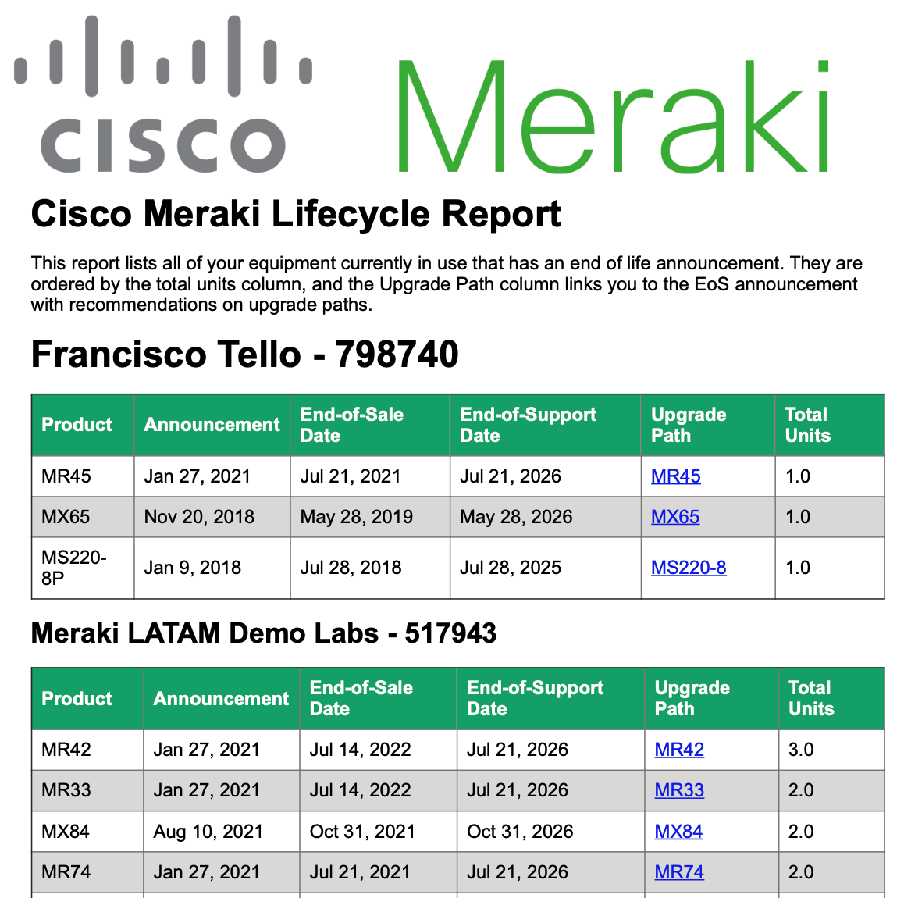
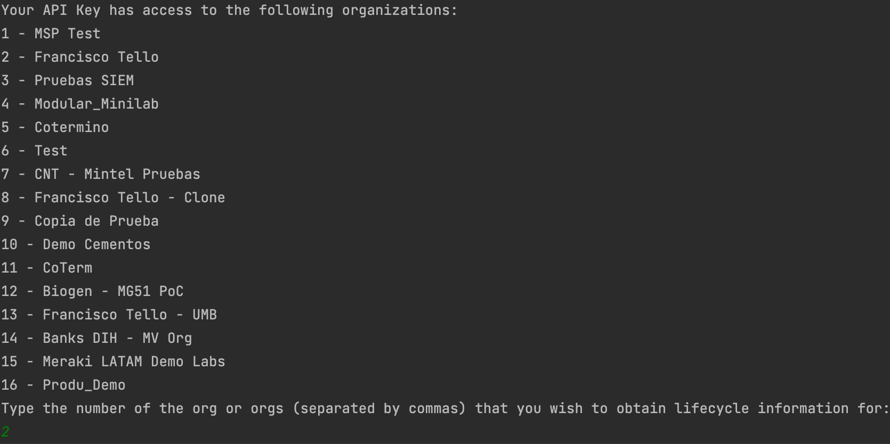
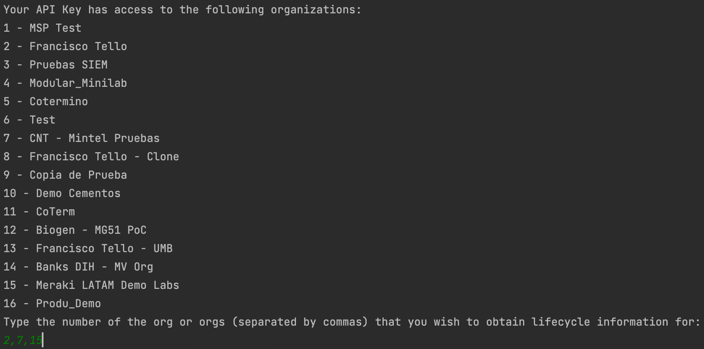
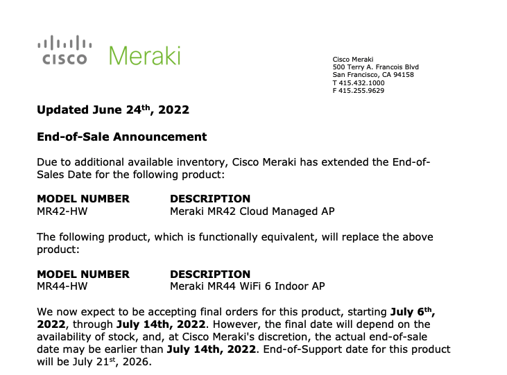

# merakiLifecycleReport
Obtain a lifecycle report from all of your Cisco Meraki organizations, detailing how many of your devices have EoL announcements published.

# Table of Contents

[Introduction](#intro)

[Prerequisites](#prereq)

[How to use](#howtouse)

[Results](#results)

<a name="intro"/>

# Introduction

This script allows you to obtain a report of all of the End of Sales and End of Support equipment in your Cisco Meraki Organizations. It will output an HTML document and a PDF document with a table summarizing the organization inventory with:

1. Counts of active devices per SKU
2. Date when the device had its End of Life announcement
3. End of Sales and End of Support Dates
4. Links to Upgrade paths for each SKU

<a name="prereq"/>

## Prerequisites

1. Active Cisco Meraki subscriptions in the orgs where the script will be run
2. API access enabled for these organizations, as well as an API Key with access to them. See how to enable [here](https://documentation.meraki.com/General_Administration/Other_Topics/Cisco_Meraki_Dashboard_API)
3. A working Python environment
4. Install libraries in `requirements.txt`

<a name="howtouse"/>

## How to Use

1. Clone repo to your working directory
2. Edit `config.py` with your API Key in between the quotation marks next to `api_key = `
3. Run `pip install -r requirements.txt` from your terminal
4. Run the script `python main.py`
5. You will be prompted with a list of the organizations your API Key has access to
6. Enter a single number, or a string of comma separated numbers depending on which orgs you want to obtain lifecycle information for (see examples below)
7. The script will output a `html_report.html` file and a `Lifecycle Report.pdf` file to your working folder

Selecting a single organization.

Selecting multiple organizations.

<a name="results"/>

## Results

Your two output files will contain one table for each of the organizations you obtained lifecycle information for. Each of them will have the following columns:

1. **Product:** SKU that was detected to have an EoS announcement
2. **Announcement:** Date on which Cisco Meraki published the EoS document
3. **End-of-Sale Date:** Date after which the equipment will no longer be sold to customers
4. **End-of-Support Date:** Date after which the equipment will no longer be supported by Cisco Meraki Support
5. **Upgrade Path:** Link to the End of Sales announcement with suggested replacement SKUs
6. **Total Units:** Count of total units in use of the specified SKU in the organization. Units not bound to any networks are assumed to not be in use and are not included in this count. Additionally, the table is ordered in descending order by this metric.

Sample page you navigate to when clicking the Upgrade Path links.

For more information on Meraki support procedures and warranties visit:

1. [Returns, Warranties and End-of-Life Information](https://documentation.meraki.com/General_Administration/Other_Topics/Returns_(RMAs)%2C_Warranties_and_End-of-Life_Information)
2. [Meraki End-of-Life (EOL) Products and Dates](https://documentation.meraki.com/General_Administration/Other_Topics/Meraki_End-of-Life_(EOL)_Products_and_Dates)
3. [Meraki Support Overview](https://meraki.cisco.com/meraki-support/overview/)
